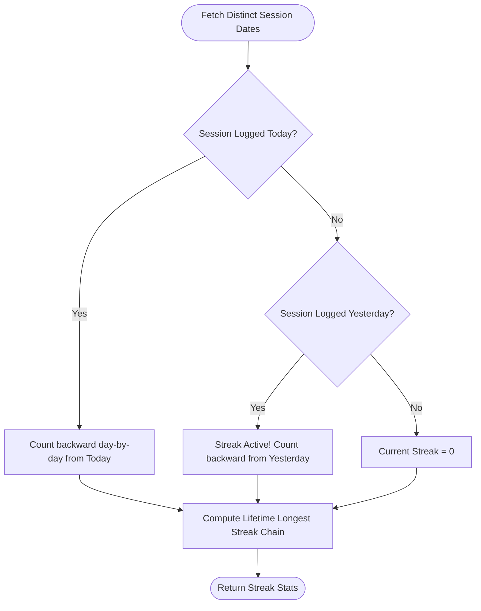
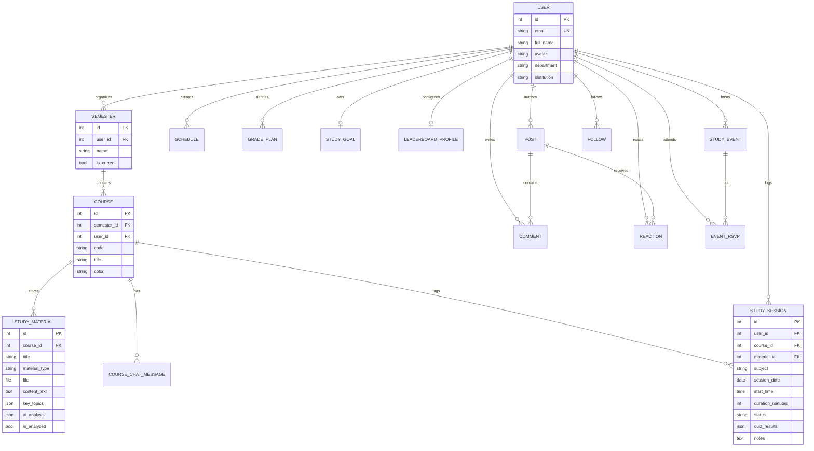

# 🎓 StudentBrain — Intelligent Academic Command Center & Study Network

[](https://www.djangoproject.com/)
[](https://react.dev/)
[](https://vitejs.dev/)
[](https://www.postgresql.org/)
[](https://deepmind.google/technologies/gemini/)
[-3DDC84?logo=android&logoColor=white)](https://github.com/souravsahapartho/uiu-student-brain/releases/download/v2.4.0/StudentBrain-v2.4.0.apk)
[](https://www.docker.com/)
[](https://nginx.org/)
[](https://www.uiu.ac.bd/)
[](https://opensource.org/licenses/MIT)

> **StudentBrain** is an all-in-one academic operating system designed for modern university scholars. It unifies official course curriculum management, dynamic UIU BSCSE course autocomplete with exam-slot clash prevention, intelligent schedule planning, real-time GPA trajectory forecasting, time-gated focus session tracking, multimodal course material analysis with **Google Gemini AI**, automated post-session diagnostic concept testing, gamified study leaderboards, and an interactive peer community network.

---

## 📱 Mobile Application (Android APK Release v2.4.0)

Get the official **StudentBrain Android App (v2.4.0)** directly on your device:

- 🚀 **Direct Download (v2.4.0)**: [**Download StudentBrain-v2.4.0.apk**](https://github.com/souravsahapartho/uiu-student-brain/releases/download/v2.4.0/StudentBrain-v2.4.0.apk)
- 📦 **GitHub Releases Page**: [**View v2.4.0 Release Notes & Assets**](https://github.com/souravsahapartho/uiu-student-brain/releases/tag/v2.4.0)

---

## 📑 Table of Contents

1. [Mobile Application (Android APK Release)](#-mobile-application-android-apk-release)
2. [System Architecture & Design Patterns](#-system-architecture)
3. [Complete Feature Deep Dive & Background Mechanisms](#-complete-feature-deep-dive)
   - [1. Authentication & Visual Identity Engine (`accounts`)](#1-authentication--visual-identity-engine-accounts)
   - [2. UIU BSCSE Course Catalogue & Smart Autocomplete Engine](#2-uiu-bscse-course-catalogue--smart-autocomplete-engine)
   - [3. Study Schedule Maker & Routine Planner (`planner`)](#3-study-schedule-maker--routine-planner-planner)
   - [4. Grade Planner, GPA Projection & Course Retake Advisor (`grades`)](#4-grade-planner-gpa-projection--course-retake-advisor-grades)
   - [5. Scheduled Study Tracker & Focus Sessions (`tracker`)](#5-scheduled-study-tracker--focus-sessions-tracker)
   - [6. Post-Session Gemini AI Diagnostic Testing & Weak Topic Reports (`tracker` + `ai`)](#6-post-session-gemini-ai-diagnostic-testing--weak-topic-reports)
   - [7. Interactive Detailed Solution Breakdown & AI Concept Explanations](#7-interactive-detailed-solution-breakdown--ai-concept-explanations)
   - [8. Study Materials Hub, Native Reader & Multi-Format Exporter (`materials`)](#8-study-materials-hub-native-reader--multi-format-exporter-materials)
   - [9. Course-Specific AI Chat Assistant (`materials` + `ai`)](#9-course-specific-ai-chat-assistant)
   - [10. Gamified Rewards, Streaks & Milestone Badges (`tracker`)](#10-gamified-rewards-streaks--milestone-badges-tracker)
   - [11. Cross-Module Academic Analytics Dashboard (`analytics`)](#11-cross-module-academic-analytics-dashboard-analytics)
   - [12. Student Community, Discussions & Study Events (`community`)](#12-student-community-discussions--study-events-community)
   - [13. Privacy-Preserving Global Study Leaderboard (`community`)](#13-privacy-preserving-global-study-leaderboard-community)
4. [Under-the-Hood Algorithms & Mathematical Formulations](#-under-the-hood-algorithms--mathematical-formulations)
   - [A. Weighted Credit GPA Projection & Feasibility Math](#a-weighted-credit-gpa-projection--feasibility-math)
   - [B. Dynamic Streak Continuity & Gap Recovery Algorithm](#b-dynamic-streak-continuity--gap-recovery-algorithm)
   - [C. Dynamic Milestone Trophy & Badge Unlocking Logic](#c-dynamic-milestone-trophy--badge-unlocking-logic)
   - [D. Schedule Adherence Audit Metric](#d-schedule-adherence-audit-metric)
   - [E. Multi-Tier Deterministic Leaderboard Ranking Engine](#e-multi-tier-deterministic-leaderboard-ranking-engine)
5. [Database Schema & Entity Relationship Diagram (ERD)](#-database-schema--entity-relationship-diagram)
6. [Local Development Setup (Docker & Native)](#-local-development-setup)
7. [Multi-Device & Remote Network Access](#-multi-device--remote-network-access)
8. [Production Deployment Guide (Debian 13, Nginx, Gunicorn, SSL)](#-production-deployment-guide)
9. [Pre-Seeded Demo Accounts & Credentials](#-pre-seeded-demo-accounts--credentials)
10. [Project Team & Contributors](#-project-team--contributors)

---

## 🏛️ System Architecture

StudentBrain strictly adheres to **Clean Architecture / Service-Layer Pattern** on the backend and a **Feature-Driven Modular Architecture** on the frontend:

```mermaid
graph TD
    UserBrowser["Client Browser (Desktop / Mobile / Tablet)"]
    NginxProxy["Nginx Reverse Proxy (:80 / :443)"]
    FrontendApp["React 19 SPA (Vite + Dynamic Host Resolver)"]
    DjangoBackend["Django REST Framework Backend (Gunicorn WSGI :8000)"]
    PostgresDB[("PostgreSQL 16 Database (:5432)")]
    GeminiAPI["Google Gemini 2.0 Flash AI API"]
    MediaStorage["Mounted Persistent Media Storage (/app/media)"]

    UserBrowser -->|HTTP/HTTPS| NginxProxy
    NginxProxy -->|/ (HTML, CSS, JS)| FrontendApp
    NginxProxy -->|/api/ & /admin/| DjangoBackend
    NginxProxy -->|/media/ & /static/| MediaStorage

    FrontendApp -->|Axios JWT Interceptor| DjangoBackend
    DjangoBackend -->|Thin View Layer| SerializerLayer["DRF Serializers & Validation"]
    DjangoBackend -->|Service Layer| BusinessLogic["Domain Services (services.py)"]
    BusinessLogic -->|ORM QuerySet| PostgresDB
    BusinessLogic -->|Async SDK Calls| GeminiAPI
    BusinessLogic -->|File IO| MediaStorage
```

### Core Architectural Principles:

1. **Service Layer Separation**: Views in `views.py` remain ultra-thin — they only deserialize requests, enforce JWT authentication/permissions, and return JSON responses. **All business logic, mathematical projections, and AI pipelines live exclusively in `services.py`**.
2. **Stateless JWT Security**: Dual-token strategy with short-lived Access Tokens (15 min) and persistent Refresh Tokens (7 days). The frontend Axios client includes automatic queue-based refresh interceptors.
3. **Dynamic Host Resolution**: Frontend client automatically resolves its API base URL from `window.location.hostname`, ensuring seamless cross-device, local LAN, and tunnel accessibility without recompilation.
4. **Optimized DB Aggregations**: Complex statistical aggregations leverage PostgreSQL database-level annotations (`Sum`, `Count`, `Avg`, `Q`) for sub-millisecond execution.

---

## 🚀 Complete Feature Deep Dive

---

### 1. Authentication & Visual Identity Engine (`accounts`)

- **Purpose**: Secure onboarding, biometric-friendly identity management, customized scholar profiles, and authentic university brand immersion.
- **How It Works**:
  - Employs custom `User` model inheriting from `AbstractBaseUser` and `PermissionsMixin` with email as unique identifier.
  - Passwords hashed via PBKDF2 with SHA-256 and automatic salt rotation.
  - **Modern StudentBrain Visual Identity**: Both Login and Register experiences feature high-definition StudentBrain branding badges, orbital product intelligence showcases, dynamic theme toggling, and ambient glowing backdrops.
  - **Scholar Profile Management**: Supports customized avatars, bio, department/major, student ID, custom daily study goal selection, and privacy settings.
  - Dual-token JWT lifecycle: Access token attached to all requests via `Authorization: Bearer <token>`; token expiration is automatically caught by Axios interceptors to request a new token seamlessly without logging out the student.

---

### 2. UIU BSCSE Course Catalogue & Smart Autocomplete Engine

- **Purpose**: Eliminates typing errors, enforces official course metadata, displays prerequisite requirements, and prevents final exam slot scheduling clashes.
- **How It Works**:
  - **Embedded Trimester Syllabus Matrix**: Sourced from official UIU BSCSE curriculum specifications spanning **Trimester 1 to 12**, General Education electives (AI Literacy, Economics, Accounting, Entrepreneurship), and major elective tracks.
  - **Intelligent Ranking Autocomplete (`CourseAutocomplete.jsx`)**:
    - Real-time prefix, acronym, code, and title matching as the student types.
    - Displays Course Code, Full Title, Credit Hours (3.0, 2.0, 1.0), and Theory vs. Lab badges.
    - Displays **Trimester level** (e.g. `Trimester 3`), **Prerequisites** (e.g. `Prereq: CSE 1111`), and **Exam Slot Matrix** (e.g. `Exam: Day 4 (T2)`).
    - Selecting any course instantly auto-fills the course title, code, and credit load.
  - **Seamless Integration**: Active across **Grade Planner** (Retake / Add Course), **Semester Study Planner** (Create Course Modal), and **Class Routine Planner** (Schedule Form).

---

### 3. Study Schedule Maker & Routine Planner (`planner`)

- **Purpose**: Weekly time-blocking, class routine organization, and assignment deadline tracking.
- **How It Works**:
  - Students create recurring weekly schedule blocks specifying subject, start time, end time, location/room, multi-day recurring chips (e.g. _Mon, Wed, Fri_), color theme, and assignment deadlines.
  - Integrated with the **UIU Course Autocomplete Engine** for rapid routine entry.
  - Built-in validation guarantees schedule integrity (`start_time < end_time`).
  - Real-time sorting and filter tabs allow viewing today's upcoming classes or the full 7-day academic grid.

---

### 4. Grade Planner, GPA Projection & Course Retake Advisor (`grades`)

- **Purpose**: Degree credit audits, cumulative GPA tracking, course retake scenario analysis, and mathematical required score forecasting.
- **How It Works**:
  - Tracks total degree credits, completed credits, current cumulative GPA, and target graduation GPA.
  - **Course Retake Advisor**: Allows students to add previous courses with initial grade and simulate retake grades to observe direct trajectory impact on overall CGPA.
  - Dynamically computes the **Exact Required GPA** needed across all remaining credit hours using weighted quality points formulas.
  - Feasibility Audit: If the required GPA exceeds $4.00$, the system highlights the goal in warning amber with actionable guidance to adjust the target.

---

### 5. Scheduled Study Tracker & Focus Sessions (`tracker`)

- **Purpose**: Real-time focus tracking with calendar scheduling, material linking, custom durations, and time-gating.
- **How It Works**:
  - **Scheduled Focus Blocks**: Students book study sessions with a scheduled date, start time, flexible duration (quick preset chips or custom minute input), linked course, and attached study material.
  - **Strict Time-Gating**: Sessions are locked until the scheduled start time arrives, preventing premature completions and fostering true academic discipline.
  - **Live Focus Timer**: Includes full-screen focus mode, pause/resume, and extension options (+15m, +30m, +45m) with real-time goal progress updates.
  - **Multi-Format Session Logging**: Supports scheduled sessions, live Pomodoro sessions, and retroactive manual logging.

---

### 6. Post-Session Gemini AI Diagnostic Testing & Weak Topic Reports

- **Purpose**: Verifies concept mastery immediately upon finishing a study block and pinpoints weak areas.
- **How It Works**:
  - **Instant Quiz Trigger**: When a student completes a focus session linked to a study material, they can immediately launch a **Gemini AI Diagnostic Assessment**.
  - **Concept Extraction**: Backend feeds the study material text to `gemini-2.0-flash`, generating 4–5 multiple-choice questions assessing core concepts, edge cases, and principles.
  - **Diagnostic Weak Topic Report**:
    - Highlights overall score percentage and mastery badge (_Proficient_, _Review Needed_, etc.).
    - Outlines specifically detected **Weak Topics** where the student missed questions.
    - Generates personalized AI study recommendations and key takeaways.

---

### 7. Interactive Detailed Solution Breakdown & AI Concept Explanations

- **Purpose**: High-clarity interactive answer review for diagnostic tests with conceptual reinforcement.
- **How It Works**:
  - Displays each question with responsive question cards and color-coded status badges (`Correct`, `Incorrect`, `Unanswered`).
  - **Interactive Options Review**: Side-by-side comparison displaying the student's selected answer vs. the correct answer with letter badge highlights and status tags.
  - **AI Concept Explanation Box**: Features dedicated conceptual breakdown cards generated by Gemini AI explaining why the correct option is scientifically sound and where typical misunderstandings arise.

---

### 8. Study Materials Hub, Native Reader & Multi-Format Exporter (`materials`)

- **Purpose**: Centralized course document repository, rich Markdown notes editor, in-browser reader, and multi-format document support.
- **How It Works**:
  - **Broad Multi-Format Ingestion**: Upload lecture slides, syllabus documents, textbooks, spreadsheets, and notes (`.pdf`, `.docx`, `.txt`, `.md`, `.csv`, `.png`, `.jpg`, `.jpeg`).
  - **Multimodal Text Extraction**: Powered by `pypdf` and XML docx parsers, automatically extracting plain text from uploaded files on save.
  - **AI Analysis Pipeline**: Runs background Gemini AI analysis on uploaded materials to extract key topics, chapter summaries, formula sheets, and study cheat-sheets.
  - **Native Document Reader**: Full-screen reader with dark/light modes, table of contents generator, and instant text search.
  - **PDF Export Engine**: Built on Python `reportlab`, generating formatted downloadable PDF study guides with university branding.

---

### 9. Course-Specific AI Chat Assistant

- **Purpose**: 24/7 AI tutor grounded exclusively in the student's enrolled course materials.
- **How It Works**:
  - Students can open an interactive AI chat interface within any course.
  - The backend constructs a dynamic context window containing extracted lecture summaries, note transcripts, and key topics.
  - Gemini AI answers student questions with precise citations, step-by-step mathematical proofs, and conceptual analogies.

---

### 10. Gamified Rewards, Streaks & Milestone Badges (`tracker`)

- **Purpose**: Fosters consistent daily learning habits through streak mechanics and milestone achievements.
- **How It Works**:
  - **Custom Daily Goals**: Students configure daily target focus minutes (default: 60 min, with custom presets or exact minute values from the profile).
  - **Continuous Streak Engine**: Analyzes unique session dates in chronological order to detect active streaks, preserved streaks, or gap resets.
  - **8 Tiered Milestone Badges**:
    - 🌱 **First Step**: First focus session logged.
    - 🔥 **Ignition Flame**: 3-day consecutive study streak.
    - ⚡ **Unstoppable Momentum**: 7-day consecutive streak.
    - 👑 **Academic Master**: 14-day consecutive streak.
    - ⏱️ **Focus Initiate**: 5 hours (300 mins) total study.
    - 📚 **Deep Scholar**: 20 hours (1,200 mins) total study.
    - 🏆 **Centurion of Knowledge**: 100 hours (6,000 mins) total study.
    - 🎯 **Daily Champion**: Hit daily target today.

---

### 11. Cross-Module Academic Analytics Dashboard (`analytics`)

- **Purpose**: Visual intelligence aggregating data from Tracker, Planner, Materials, and Grade Planner.
- **How It Works**:
  - **Weekly Focus Histogram**: 7-day bar chart detailing daily focus minutes.
  - **Subject Investment Distribution**: Multi-colored segmented progress bar showing proportional focus per course.
  - **Schedule Adherence Audit**: Measures alignment between scheduled classes and actual study time.
  - **Academic Intelligence Feed**: Automated heuristics recommending balance adjustments, rest days, or exam prep focus.

---

### 12. Student Community, Discussions & Study Events (`community`)

- **Purpose**: Peer collaboration, academic Q&A forums, study groups, and campus review sessions.
- **How It Works**:
  - **Discussions Hub**: Categorized forum (_General, Exam Prep, Study Groups, Course Help, Resources_) with nested comments and live upvote reactions.
  - **Study Events & RSVP**: Students create in-person or virtual exam prep events with live attendee RSVP tracking.
  - **Peer Social Directory**: Follow/unfollow classmates, search scholars by major, and view public achievement stats.

---

### 13. Privacy-Preserving Global Study Leaderboard (`community`)

- **Purpose**: Healthy academic competition with strict privacy controls.
- **How It Works**:
  - **Opt-In Privacy Guard**: Students control leaderboard visibility via `is_opted_in` flag; opted-out student data remains 100% private.
  - **Custom Academic Motto**: Display personalized inspiration quotes on profile badges.
  - **3 Filtering Modes**: Weekly Focus (last 7 days), Streak Masters (active streaks), and All-Time Focus (lifetime total).
  - **Top 3 Podium**: Elevated podium displaying Gold, Silver, and Bronze student cards.

---

## 🧮 Under-the-Hood Algorithms & Mathematical Formulations

### A. Weighted Credit GPA Projection & Feasibility Math

Let:

- $C_{curr} = \text{Completed Credits}$
- $C_{tot} = \text{Total Program Credits}$
- $C_{rem} = C_{tot} - C_{curr} = \text{Remaining Credits}$
- $GPA_{curr} = \text{Current Cumulative GPA}$
- $GPA_{target} = \text{Target Cumulative GPA}$

The required GPA ($GPA_{req}$) on the remaining credits is computed as:

$$\text{Total Quality Points Target} = GPA_{target} \times C_{tot}$$

$$\text{Current Quality Points Earned} = GPA_{curr} \times C_{curr}$$

$$GPA_{req} = \frac{(GPA_{target} \times C_{tot}) - (GPA_{curr} \times C_{curr})}{C_{rem}}$$

$$\text{Feasibility Status} = \begin{cases} \text{Feasible (Green)}, & \text{if } GPA_{req} \le 4.00 \\ \text{Unreachable (Amber)}, & \text{if } GPA_{req} > 4.00 \end{cases}$$

---

### B. Dynamic Streak Continuity & Gap Recovery Algorithm



1. **Current Streak**:
   - If today's date $D_0 \in \text{Dates}$: $S_{curr} = 1 + \text{count consecutive prior days } (D_0 - 1, D_0 - 2, \dots)$.
   - If $D_0 \notin \text{Dates}$ but $(D_0 - 1) \in \text{Dates}$: Streak is alive for today. Count backwards from yesterday.
   - If $(D_0 - 1) \notin \text{Dates}$: Streak resets to $0$.
2. **Longest Streak**:
   - Sort all unique dates chronologically: $\Delta(D_{i}, D_{i-1}) = 1 \implies \text{increment streak counter}$.
   - Keep running maximum across all recorded history.

---

### C. Dynamic Milestone Trophy & Badge Unlocking Logic

For any badge with threshold $T$ and current student metric $V$:

$$\text{Progress Percentage} = \min\left(100, \left\lfloor \frac{V}{T} \times 100 \right\rfloor\right)$$

$$\text{Badge Unlocked} = (V \ge T)$$

---

### D. Schedule Adherence Audit Metric

$$\text{Scheduled Courses} = \{ s.\text{subject} \mid s \in \text{Weekly Schedules} \}$$

$$\text{Studied Courses (7d)} = \{ sess.\text{subject} \mid sess \in \text{Sessions in Last 7 Days} \}$$

$$\text{Adherence Rate (\%)} = \frac{|\text{Scheduled Courses} \cap \text{Studied Courses (7d)}|}{|\text{Scheduled Courses}|} \times 100$$

---

### E. Multi-Tier Deterministic Leaderboard Ranking Engine

Ranks participants with zero ambiguity using prioritized deterministic tie-breakers:

- **Weekly Focus**: Primary: $\text{weekly\_minutes} \downarrow$, Secondary: $\text{current\_streak} \downarrow$, Tertiary: $\text{total\_minutes} \downarrow$, Quaternary: $\text{full\_name} \uparrow$.
- **Streak Masters**: Primary: $\text{current\_streak} \downarrow$, Secondary: $\text{longest\_streak} \downarrow$, Tertiary: $\text{weekly\_minutes} \downarrow$, Quaternary: $\text{full\_name} \uparrow$.
- **All-Time Focus**: Primary: $\text{total\_minutes} \downarrow$, Secondary: $\text{total\_sessions} \downarrow$, Tertiary: $\text{current\_streak} \downarrow$, Quaternary: $\text{full\_name} \uparrow$.

---

## 🗄️ Database Schema & Entity Relationship Diagram



---

## 🛠️ Local Development Setup

### Quick Start with Docker (Recommended)

1. **Clone the repository**:

   ```bash
   git clone https://github.com/souravsahapartho/uiu-student-brain.git
   cd uiu-student-brain
   ```

2. **Configure environment variables**:

   ```bash
   cp .env.example .env
   # Add your GEMINI_API_KEY in .env
   ```

3. **Start all services**:

   ```bash
   docker compose up -d --build
   ```

4. **Access the application**:
   - Frontend: `http://localhost:5173`
   - Backend API: `http://localhost:8000/api/`
   - Django Admin: `http://localhost:8000/admin/`

---

### Native Setup (Without Docker)

#### Backend (Django REST Framework)

```bash
cd backend
python -m venv venv
# Windows:
.\venv\Scripts\activate
# Linux/macOS:
source venv/bin/activate

pip install -r requirements.txt
python manage.py migrate
python manage.py runserver 0.0.0.0:8000
```

#### Frontend (React + Vite)

```bash
cd frontend
npm install
npm run dev
```

---

## 🌐 Multi-Device & Remote Network Access

StudentBrain includes built-in scripts to test and present your app on multiple devices:

### Option 1: Access from Other Computers on the Same Wi-Fi / LAN

```bash
./scripts/share_network.sh
```

Open `http://<YOUR_LOCAL_IP>:5173` on any computer, phone, or tablet connected to your Wi-Fi.

### Option 2: Instant Public Internet Access (Cloudflare Tunnel)

```bash
./scripts/share_tunnel.sh
```

This generates a live public HTTPS link (e.g., `https://random-words.trycloudflare.com`) accessible from anywhere in the world!

---

## 🚢 Production Deployment Guide

### Deploying on Debian 13 (Trixie) / Ubuntu Linux VPS

1. **Clone and run the automated deployment script**:

   ```bash
   git clone https://github.com/souravsahapartho/uiu-student-brain.git /opt/student-brain
   cd /opt/student-brain
   ./scripts/deploy.sh
   ```

2. **The script automatically**:
   - Validates system dependencies & Docker.
   - Builds production images (`student-brain-backend`, `student-brain-frontend`, `student-brain-nginx`).
   - Runs database migrations & collects Django static files.
   - Launches Gunicorn WSGI and Nginx reverse proxy on Port 80/443.

3. **Enable Free SSL Certificate**:
   ```bash
   sudo certbot --nginx -d yourdomain.com -d www.yourdomain.com
   ```

---

## 👥 Pre-Seeded Demo Accounts & Credentials

All pre-seeded demo accounts share the password: **`Password123!`**

| #   | Scholar Name               | Email                          | Department & Major                        | Focus Highlights                                                           |
| --- | -------------------------- | ------------------------------ | ----------------------------------------- | -------------------------------------------------------------------------- |
| 1   | **Baitun Nahar Bithy**     | `baitun.bithy@example.com`     | Biochemistry & Molecular Biology          | 🥇 **Rank #1** (48h focus, 10-day streak, 3.98 GPA, Organic Review Host)   |
| 2   | **Jamil Hossain**          | `jamil.hossain@example.com`    | Computer Science & Engineering (CSE)      | 🥈 **Rank #2** (38h focus, 8-day streak, 3.95 GPA, LeetCode Bootcamp Host) |
| 3   | **Saptarshi Biswas Supty** | `saptarshi.supty@example.com`  | Applied Mathematics & Statistics          | 🥉 **Rank #3** (29h focus, 6-day streak, 3.96 GPA, Real Analysis proofs)   |
| 4   | **Sourav Saha**            | `souravs.aha@example.com`      | Software Engineering (SWE)                | 🏅 **Rank #4** (21h focus, 5-day streak, Distributed Systems & Cloud)      |
| 5   | **Rayhan Chowdhury**       | `rayhan.chowdhury@example.com` | Mechanical & Mechatronics Engineering     | 🏅 **Rank #5** (17h focus, Robotics & Microcontrollers, CAD FEA)           |
| 6   | **Rafiq Al Mustafa**       | `rafiq.mustafa@example.com`    | Electrical & Electronic Engineering (EEE) | 🏅 **Rank #6** (12h focus, Signals & Linear Systems, Semiconductors)       |
| 7   | **Shofiqur Rahaman**       | `shofiqur.rahaman@example.com` | Economics & Quantitative Finance          | 🏅 **Rank #7** (8h focus, Econometrics & OLS Regression)                   |

---

## 👨‍💻 Project Team & Contributors

- **Rafayet Hossen** — Full-Stack Architecture, Study Tracker, Gemini AI Diagnostic Testing, Academic Analytics Dashboard, DevOps & Deployment.
- **Sourav Saha** — Community Discussions Hub, Study Events Engine, Global Leaderboard Service, UIU BSCSE Autocomplete & Dynamic Course Catalogue Integration, Android Mobile Release Deployment.
- **Baitun Nahar Bithy** — Academic UI/UX Design System, Grade Planner & GPA Forecasting Engine.
- **Saptarshi Biswas Supty** — Academic UI/UX Design System, Study Schedule Maker & Routine Planner.

---

<p align="center">
  <b>StudentBrain</b> — Empowering Scholars to Master Their Academic Potential. 🚀
</p>
