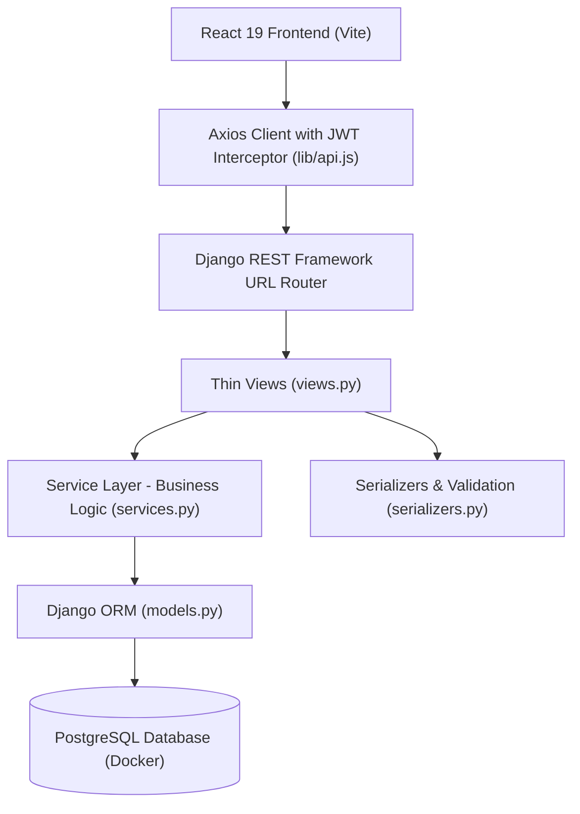
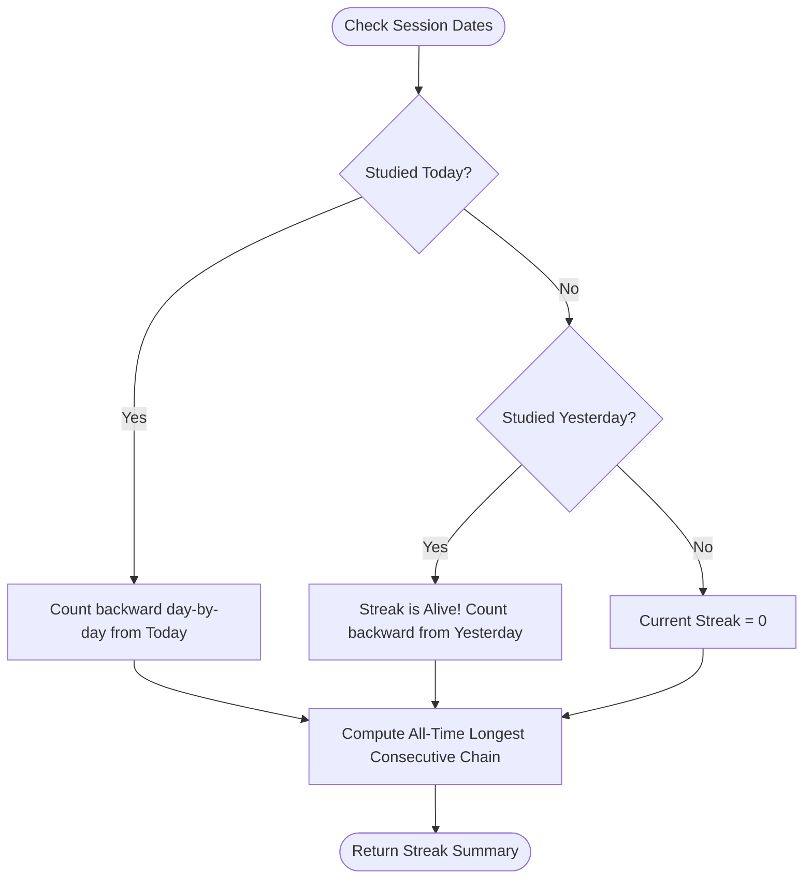
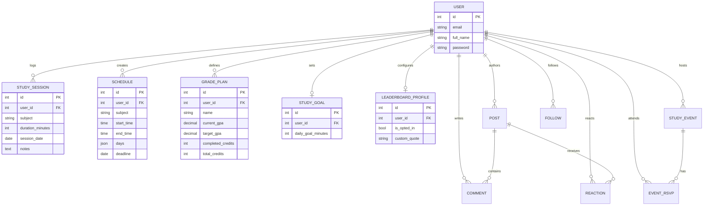
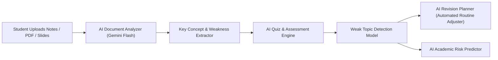

# 🎓 StudentBrain — Intelligent Academic Command Center & Study Network

[](https://www.djangoproject.com/)
[](https://react.dev/)
[](https://vitejs.dev/)
[](https://www.postgresql.org/)
[](https://www.python.org/)
[](#-system-architecture)

> **StudentBrain** is an academic management platform designed to help university and college scholars optimize study habits, forecast GPA trajectories, maintain consistent study streaks, analyze course focus investments, and collaborate in peer academic study groups.

---

## 📑 Table of Contents

1. [System Architecture & Design Patterns](#-system-architecture)
2. [Completed Features & Working Mechanisms (Phase 1)](#-completed-features--working-mechanisms)
   - [1. Authentication & User Management (`accounts`)](#1-authentication--user-management-accounts)
   - [2. Study Schedule Maker (`planner`)](#2-study-schedule-maker-planner)
   - [3. Grade Planner & GPA Projection Engine (`grades`)](#3-grade-planner--gpa-projection-engine-grades)
   - [4. Study Tracker & Session Logging (`tracker`)](#4-study-tracker--session-logging-tracker)
   - [5. Gamified Rewards & Streaks Engine (`tracker`)](#5-gamified-rewards--streaks-engine-tracker)
   - [6. Cross-Module Academic Analytics Dashboard (`analytics`)](#6-cross-module-academic-analytics-dashboard-analytics)
   - [7. Student Community, Events & Peer Network (`community`)](#7-student-community-events--peer-network-community)
   - [8. Gamified Study Leaderboard (`community`)](#8-gamified-study-leaderboard-community)
3. [Under-the-Hood Algorithms & Mathematical Models](#-under-the-hood-algorithms--mathematical-models)
   - [GPA Projection & Feasibility Math](#a-gpa-projection--feasibility-math)
   - [Streak Continuity & Gap Recovery Algorithm](#b-streak-continuity--gap-recovery-algorithm)
   - [Dynamic Achievement Badge Engine](#c-dynamic-achievement-badge-engine)
   - [Schedule Adherence Formula](#d-schedule-adherence-formula)
   - [Multi-Tier Leaderboard Ranking Algorithm](#e-multi-tier-leaderboard-ranking-algorithm)
4. [Database Schema & Entity Relationships](#-database-schema--entity-relationships)
5. [Getting Started & Local Setup](#-getting-started--local-setup)
6. [Pre-Seeded Bangladeshi Demo Scholar Accounts](#-pre-seeded-bangladeshi-demo-scholar-accounts)
7. [Phase 2 Roadmap: AI Services Integration](#-phase-2-roadmap-ai-services-integration)

---

## 🏛️ System Architecture

StudentBrain strictly follows a **Clean Architecture / Service-Layer Pattern** on the backend and a **Feature-First Component Architecture** on the frontend:



### Key Architectural Principles:
1. **Separation of Concerns**: Django `views.py` files remain ultra-thin — they only handle HTTP protocol negotiation, permission checks, and serializer invocation. **All business computations, mathematical formulas, and database mutations reside strictly in `services.py`**.
2. **Stateless JWT Authentication**: Access tokens (15m expiry) and Refresh tokens (1d expiry) manage authenticated sessions securely via HTTP headers (`Authorization: Bearer <access_token>`).
3. **Optimized Aggregations**: Complex statistical aggregations utilize PostgreSQL DB-level annotations (`Sum`, `Count`, `Avg`) to maintain sub-millisecond query execution.

---

## 🚀 Completed Features & Working Mechanisms

### 1. Authentication & User Management (`accounts`)
* **Purpose**: Secure scholar onboarding, identity management, and credential authorization.
* **Working Mechanism**:
  * Employs custom `User` model inheriting from `AbstractBaseUser` and `PermissionsMixin` with email as the unique identifier.
  * Password hashing utilizes industry-standard PBKDF2 with SHA-256 and automatic salt rotation.
  * On login, DRF SimpleJWT generates paired asymmetric HMAC-signed JSON Web Tokens (`access` + `refresh`).
  * Axios request interceptor dynamically attaches JWT headers to all outbound requests and handles `401 Unauthorized` token renewal seamlessly.

---

### 2. Study Schedule Maker (`planner`)
* **Purpose**: Structured weekly time-blocking, workload balancing, and academic deadline tracking.
* **Working Mechanism**:
  * Scholars configure weekly courses, specific start and end times, multi-day recurring chips (e.g., *Monday, Wednesday, Friday*), and assignment deadlines.
  * `services.py` validates schedule time integrity (`start_time < end_time`) and organizes queries by upcoming deadlines.
  * Interactive UI allows filtering and active day selection with custom styled badge chips.

---

### 3. Grade Planner & GPA Projection Engine (`grades`)
* **Purpose**: Real-time degree credit audit, cumulative GPA tracking, and mathematical required score forecasting.
* **Working Mechanism**:
  * Takes completed credits, total program credits, current cumulative GPA, and target degree GPA.
  * Dynamically computes the **Required Average GPA** that the student must achieve on all remaining credit hours to graduate with their target GPA.
  * Evaluates mathematical feasibility: if the required GPA exceeds $4.00$, the system flags the goal as mathematically unreachable and warns the scholar to adjust their target.

---

### 4. Study Tracker & Session Logging (`tracker`)
* **Purpose**: Real-time and retrospective study block logging with rich topic notes.
* **Working Mechanism**:
  * Records study sessions tagged by course/subject, duration in minutes, calendar session date, and Markdown-compatible study notes.
  * All CRUD operations are processed through `tracker/services.py` with validated duration boundaries ($> 0$ minutes).
  * Automatically updates aggregate study investment totals across the application.

---

### 5. Gamified Rewards & Streaks Engine (`tracker`)
* **Purpose**: Habit formation through consecutive day streaks, customizable daily targets, and milestone trophy unlocks.
* **Working Mechanism**:
  * **Customizable Daily Goals**: Scholars define target daily focus minutes (defaults to 60m/day via `StudyGoal` model).
  * **Continuous Streak Engine**: Analyzes session date distribution to determine if the streak is active today, maintained from yesterday, or broken ($> 1$ day gap).
  * **Dynamic Achievement Trophies**: Evaluates 8 gamified milestone tiers in real time:
    * 🌱 **First Step**: First session logged.
    * 🔥 **Ignition Flame**: 3-day consecutive study streak.
    * ⚡ **Unstoppable Momentum**: 7-day consecutive streak.
    * 👑 **Academic Master**: 14-day consecutive streak.
    * ⏱️ **Focus Initiate**: 5 hours (300 mins) total focus.
    * 📚 **Deep Scholar**: 20 hours (1,200 mins) total focus.
    * 🏆 **Centurion of Knowledge**: 100 hours (6,000 mins) total focus.
    * 🎯 **Daily Champion**: Hit daily focus target today.

---

### 6. Cross-Module Academic Analytics Dashboard (`analytics`)
* **Purpose**: Unified intelligence hub aggregating data across Tracker, Planner, and Grade Planner.
* **Working Mechanism**:
  * **Weekly Focus Histogram**: Aggregates daily focus minutes over the past 7 days, highlighting peak study days.
  * **Course Distribution Breakdown**: Computes exact percentage and minute allocation per subject and renders an interactive multi-colored distribution progress bar.
  * **GPA Trajectory & Credit Gauge**: Displays credit completion progress and target feasibility gauge.
  * **Schedule Adherence Audit**: Cross-references scheduled courses in the Planner against actual study sessions logged during the active week.
  * **Academic Intelligence Feed**: Generates automated rule-based recommendations on study balance, milestone progress, and pace advisories.

---

### 7. Student Community, Events & Peer Network (`community`)
* **Purpose**: Campus collaboration, academic Q&A discussions, study events, and peer networking.
* **Working Mechanism**:
  * **Discussions Feed**: Categorized forum (*General, Exam Prep, Study Group, Course Help, Resources*) with full-text search, live like toggling, and nested comment threads.
  * **Study Events & RSVP**: Enables students to host in-person or virtual exam review sessions with real-time attendee RSVP tracking.
  * **Peer Social Graph**: Follow/unfollow directory with follower/following counts and profile search.

---

### 8. Gamified Study Leaderboard (`community`)
* **Purpose**: Social motivation and friendly academic competition with privacy safeguards.
* **Working Mechanism**:
  * **Privacy-First Opt-In**: Scholars control their leaderboard visibility via `LeaderboardProfile` (`is_opted_in` flag). When opted out, their data remains 100% private.
  * **Custom Academic Motto**: Scholars can showcase an inspirational study quote (e.g. *"পরিশ্রম কখনো বৃথা যায় না"*).
  * **Top 3 Podium Display**: Gold (1st), Silver (2nd), and Bronze (3rd) elevated podium cards featuring custom avatars, hours, streaks, and badges.
  * **Multi-Timeframe Filtering**:
    * ⚡ **Weekly Focus**: Ranks participants by hours studied in the last 7 days.
    * 🔥 **Streak Masters**: Ranks participants by current active daily streaks.
    * 👑 **All-Time Focus**: Ranks participants by lifetime accumulated study hours.

---

## 🧮 Under-the-Hood Algorithms & Mathematical Models

### A. GPA Projection & Feasibility Math

Let:
* $C_{curr} = \text{Completed Credits}$
* $C_{tot} = \text{Total Program Credits}$
* $C_{rem} = C_{tot} - C_{curr} = \text{Remaining Credits}$
* $GPA_{curr} = \text{Current Cumulative GPA}$
* $GPA_{target} = \text{Target Cumulative GPA}$

The required GPA ($GPA_{req}$) on the remaining credits is derived from the weighted credit equation:

$$\text{Total Quality Points Target} = GPA_{target} \times C_{tot}$$

$$\text{Current Quality Points Earned} = GPA_{curr} \times C_{curr}$$

$$GPA_{req} = \frac{(GPA_{target} \times C_{tot}) - (GPA_{curr} \times C_{curr})}{C_{rem}}$$

**Feasibility Decision Rule**:
$$\text{Feasible} = \begin{cases} \text{True}, & \text{if } GPA_{req} \le 4.00 \\ \text{False}, & \text{if } GPA_{req} > 4.00 \end{cases}$$

---

### B. Streak Continuity & Gap Recovery Algorithm

The streak calculation engine in `tracker/services.py` processes distinct session calendar dates in descending order:



1. **Current Streak**:
   * If today's date $D_0 \in \text{Dates}$: $S_{curr} = 1 + \text{count consecutive prior days } (D_0 - 1, D_0 - 2, \dots)$.
   * If $D_0 \notin \text{Dates}$ but $(D_0 - 1) \in \text{Dates}$: Streak is still alive for today. Count backwards from yesterday.
   * If $(D_0 - 1) \notin \text{Dates}$: Streak resets to $0$.
2. **Longest Streak**:
   * Sort all unique dates chronologically: $\Delta(D_{i}, D_{i-1}) = 1 \implies \text{increment temp streak}$.
   * Keep running maximum across all recorded history.

---

### C. Dynamic Achievement Badge Engine

Every badge dynamically evaluates user statistics against criteria:

$$\text{Progress \%} = \min\left(100, \left\lfloor \frac{\text{Current Stat Value}}{\text{Target Threshold}} \times 100 \right\rfloor\right)$$

$$\text{Unlocked} = (\text{Current Stat Value} \ge \text{Target Threshold})$$

---

### D. Schedule Adherence Formula

Schedule adherence measures how well a student's actual study sessions in the last 7 days cover their planned weekly routine courses:

$$\text{Scheduled Subjects} = \{ s.\text{subject} \mid s \in \text{User Schedules} \}$$

$$\text{Studied Subjects (7d)} = \{ sess.\text{subject} \mid sess \in \text{Sessions in Last 7 Days} \}$$

$$\text{Covered} = \text{Scheduled Subjects} \cap \text{Studied Subjects (7d)}$$

$$\text{Adherence Rate (\%)} = \frac{|\text{Covered}|}{|\text{Scheduled Subjects}|} \times 100$$

---

### E. Multi-Tier Leaderboard Ranking Algorithm

For any given timeframe, participants are ranked with deterministic tie-breaking:
* **Weekly Focus**: Primary: $\text{weekly\_minutes} \downarrow$, Secondary: $\text{current\_streak} \downarrow$, Tertiary: $\text{total\_minutes} \downarrow$, Quaternary: $\text{display\_name} \uparrow$.
* **Streak Masters**: Primary: $\text{current\_streak} \downarrow$, Secondary: $\text{longest\_streak} \downarrow$, Tertiary: $\text{weekly\_minutes} \downarrow$, Quaternary: $\text{display\_name} \uparrow$.
* **All-Time Focus**: Primary: $\text{total\_minutes} \downarrow$, Secondary: $\text{total\_sessions} \downarrow$, Tertiary: $\text{current\_streak} \downarrow$, Quaternary: $\text{display\_name} \uparrow$.

---

## 🗄️ Database Schema & Entity Relationships



---

## 🛠️ Getting Started & Local Setup

### Prerequisites
* **Docker & Docker Compose** (for PostgreSQL)
* **Python 3.14+** (managed via `uv` or virtualenv)
* **Node.js 20+** & **npm**

### 1. Clone & Start Database
```bash
git clone https://github.com/Rafayet-Hossen/student-brain.git
cd student-brain

# Start PostgreSQL database container
docker compose up -d db
```

### 2. Backend Setup & Seed Data
```bash
cd backend

# Install Python dependencies and run database migrations
uv run python manage.py migrate

# Run complete automated test suite (42 unit tests)
uv run python manage.py test

# Seed database with 7 authentic Bangladeshi scholar demo accounts
uv run python seed_dummy_data.py

# Start Django backend development server (Port 8000)
uv run python manage.py runserver 127.0.0.1:8000
```

### 3. Frontend Setup
```bash
cd ../frontend

# Install dependencies
npm install

# Start Vite development server (Port 5173)
npm run dev
```

The web application is now accessible at: **`http://localhost:5173`**

---

## 🇧🇩 Pre-Seeded Bangladeshi Demo Scholar Accounts

All demo accounts share the password: **`Password123!`**

| # | Scholar Name | Email | Department & Degree | Demo Focus Highlights |
|---|--------------|-------|---------------------|-----------------------|
| 1 | **Baitun Nahar Bithy** | `baitun.bithy@example.com` | Biochemistry & Molecular Biology | 🥇 **Rank #1 Leaderboard** (48h focus, 10-day streak, 3.98 Target GPA, hosts Organic Review) |
| 2 | **Jamil Hossain** | `jamil.hossain@example.com` | Computer Science & Engineering (CSE) | 🥈 **Rank #2 Leaderboard** (38h focus, 8-day streak, 3.95 Target GPA, hosts LeetCode Bootcamp) |
| 3 | **Saptarshi Biswas Supty** | `saptarshi.supty@example.com` | Applied Mathematics & Statistics | 🥉 **Rank #3 Leaderboard** (29h focus, 6-day streak, 3.96 Target GPA, Real Analysis proofs) |
| 4 | **Sourav Saha** | `souravs.aha@example.com` | Software Engineering (SWE) | 🏅 **Rank #4 Leaderboard** (21h focus, 5-day streak, Distributed Systems & Cloud) |
| 5 | **Rayhan Chowdhury** | `rayhan.chowdhury@example.com` | Mechanical & Mechatronics Engineering | 🏅 **Rank #5 Leaderboard** (17h focus, Robotics & Microcontrollers, CAD FEA) |
| 6 | **Rafiq Al Mustafa** | `rafiq.mustafa@example.com` | Electrical & Electronic Engineering (EEE) | 🏅 **Rank #6 Leaderboard** (12h focus, Signals & Linear Systems, Semiconductors) |
| 7 | **Shofiqur Rahaman** | `shofiqur.rahaman@example.com` | Economics & Quantitative Finance | 🏅 **Rank #7 Leaderboard** (8h focus, Econometrics & OLS Regression) |

---

## 🔮 Phase 2 Roadmap: AI Services Integration

In Phase 2, StudentBrain will integrate **Google Gemini & LangChain AI microservices** to elevate academic productivity:



* **Feature #6: AI Service Core (`ai`)**: Gemini API + LangChain wrapper service.
* **Feature #7: Material Upload & Topic Extraction (`materials`)**: Multimodal document parsing and automatic topic summary generation.
* **Feature #8: Study Session Test & Weak Topic Detection (`assessments`)**: Dynamic adaptive quizzes assessing concept retention.
* **Feature #9: AI Revision Planner (`planner` extension)**: Automated schedule re-balancing prioritizing detected weak topics before deadlines.
* **Feature #12: AI Academic Risk Prediction (`analytics` extension)**: Predictive modeling to flag students at risk of falling behind target GPA milestones.

---

### 👨‍💻 Team & Contributors
* **Rafayet Hossen** — Study Tracker & Rewards Engine, Academic Analytics Dashboard.
* **Sourav Shah** — Community Discussions & Events, Study Leaderboard Engine.
* **Baitun Nahar Bithy** - Academic UI Design System, Grade Planner Engine.
* **Saptarshi Biswas Supty** - Academic UI Design System,Study Schedule Maker. 
